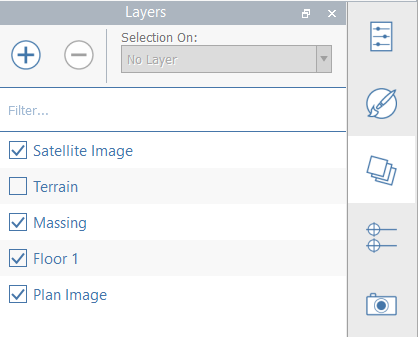
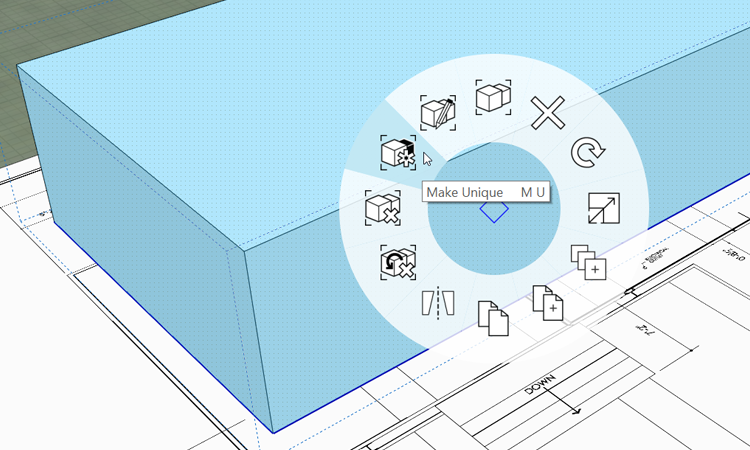

# Control Visibility with Layers

Much like AutoCAD and Photoshop, Layers in FormIt allow you to manage the visibility of objects in your scene. We are going to create a layer to save and hide the building mass for analysis in the future.

## Create Layers

1. Go to the [**Layers Palette**](../formit-introduction/tool-bars.md) and click the **+** sign three times to create three layers
2. Double click the layer names to rename them **Massing**, **Floor 1**, and **Plan Image**

   

3. Select the **main building** group and choose the **Massing** layer from the **Selection On:** drop-down at the top of the Layers tab.
4. **Single-click** to select the **plan image** group and put it on the **Plan Image** layer.

## Duplicate Group

1. Select the **main building** group again
2. Press **Ctrl + C** to copy, and then **Ctrl + Shift + V** to paste the mass in the same place.
3. The **new** copy is still selected. **Right-click** and choose **Make Unique \(MU\).**

   

**Note**: The new Group is now severed from the original.  The new group and the original group will no longer update each other.

## Create the Floor

1. **Single-click** to select either of the **main building** groups.
2. Put the group on the **Floor 1** layer using the **Selection On** drop-down in the Layers panel.
3. Uncheck the **Massing** layer to hide it to keep it safe from any accidental edits.
4. **Double-click** the **Floor 1 Group** to edit it. Re-name the group **Floor** in the Properties palette.
5. **Single-click** the **top face** to select it. Click again to start dragging the face down, and start typing **1',** and a dimension box will appear. Hit OK when you've entered the value. The resulting floor should be 1' thick.
6. **Double-click** off in space to exit the group.

   

