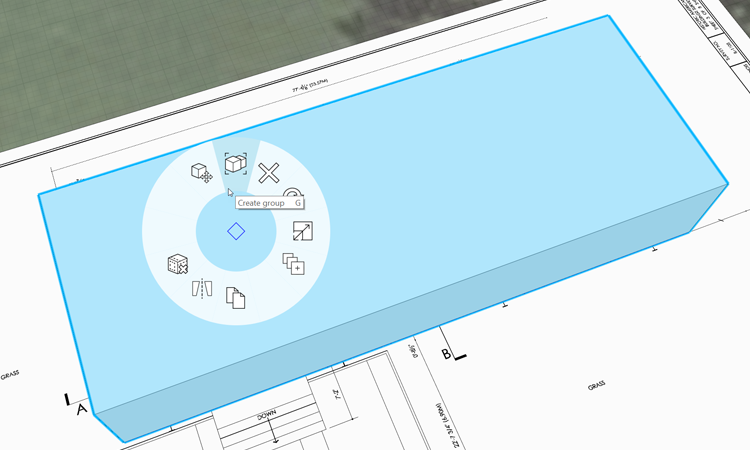
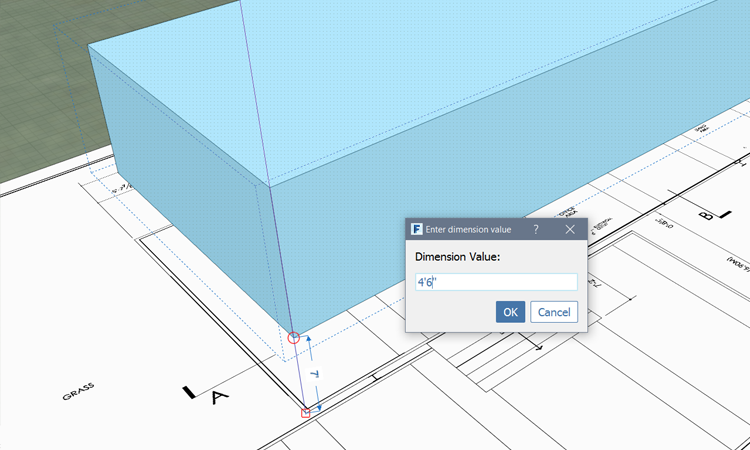
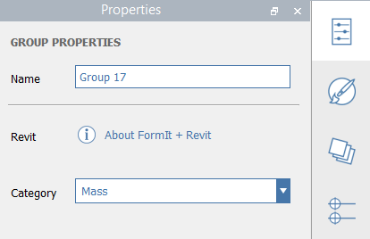
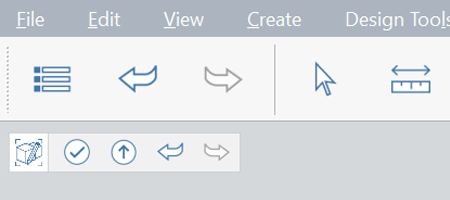
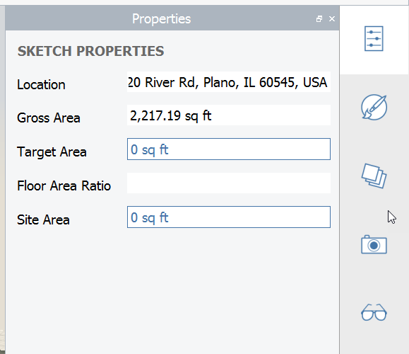

# Group Objects

When you draw lines on an existing object, the new lines "stick" to and may modify the existing objects. To avoid this, you can Group existing objects first. But this is not all Groups are good for! Copies of Groups maintain their connection to the original, such that editing any copy updates all of them. This concept is similar to Components in SketchUp and Families in Revit.

If you did not complete the last section, download and open the **farnsworth02.axm** file from the [FormIt Primer folder](https://autodesk.app.box.com/s/thavswirrbflit27rbqzl26ljj7fu1uv/1/9025446442)

## Create a Group

1. Select the upper terrace mass by **double-clicking** it
2. **Right-click** and select **Group \(G\)** or just hit shortcut **G**.

   

3. Notice that after creating a Group, you are automatically placed in the Move tool

## Move a Group

1. Turn Grid Snapping back on by typing **SG** keyboard shortcut
2. Click once on the lower corner of the mass, then move your cursor up and you should see a blue \(Z\) axis line appear
3. With the blue axis visible, type 4'-6" and a dimension dialog will appear. Once you've entered the dimension, click OK or hit Enter. This will move the entire mass up off of the ground plane along the Z axis.

   

## Edit a Group

1. **Double-click** the mass to edit it. You are now in a Group Edit mode
2. Rename the Group in the [**Properties Palette**](https://github.com/FormIt3D/autodesk-formit-360-windows-help/tree/c377e7b8a3b8e43e684321d0b7de867608d317a3/tool-library/tool-bars-extended.md)
3. Name the Group **"main building"**. We'll talk about the [**Category option in future steps**](revit-interop.md)

   

4. Closeout of Group Edit mode by clicking on the **checkmark** in the panel on the upper left corner of the canvas - or double click off in space

   

**Note**: _Each Group has its own undo/redo "stack" that is distinct from the overall project - you can click the undo and redo arrows in this panel._

## Apply Levels to a Group

1. If you had applied Levels to geometry in the previous exercise, then you will have to re-apply Levels to the new group you just created
2. Select the **main building** group by **single-clicking** on it
3. Go to the [**Properties Palette**](../formit-introduction/tool-bars.md) and check **Use Levels**
4. Check only the **Floor 1** Level and uncheck the other Levels

   

5. The **Area by Level** field will display the gross area of the currently selected object\(s\) and the area of each individual level
   * If you do not see the area reported on the Floor 1 Level, then your geometry may not intersect 4' 6"
   * If you do not see blue level lines on the object, go to the **Settings menu &gt; Visual Style &gt; Display Levels \(DL\)**
6. **Deselect** the Group by clicking **Esc** or single-clicking off in space.
7. Now the **Properties Palette** reports the **Gross Area** of the overall sketch - not just the area of the selected object

   

