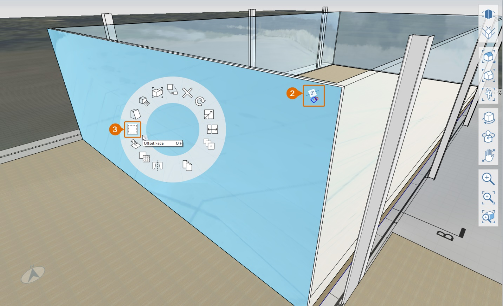
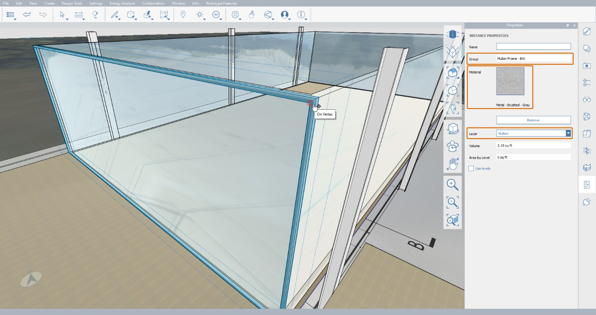
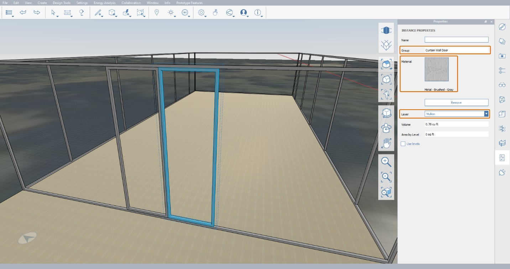

# 1.9 - Adding Details

_FormIt is a great massing tool - as well as a great modeling tool. We will start to add detail to the Farnsworth House in the form of doors and mullions for the glass box. We will then cover some additional tools, and practice the process of adding new geometry, layers, materials, and group management._

_If you did not complete the last section, download and open the_ _**1.9 - Adding Details.axm**_ _file from the_ _**FormIt Primer Part 1 Datasets**._

## **Create Window Frames**

_We are going to create a 2" metal frame and mullions around the glass box. Note that these mullions will intentionally overlap with the glass box._

1 - Create a new layer called **Glass Walls** and move the **Glass Wall** group to it.

2 - To facilitate visualization, turn off the **Roof** layer so we can see the entire glass box.

3 - To start creating the first window frame:

1. At the building’s western side, use the **Rectangle Tool \(R\)** to draw a new surface directly over the exterior glass face. Make sure to create the surface outside the **Glass Walls** group.
2. Select and drag the newly created face **2"** towards the interior. Press **Esc** to clear the selection. The final result should look like the image below.
3. Single-click the face you just created. Right-click to access the **Context Menu** to use the **Offset Face tool \(OF\).**

_**Note:**_ _If you have trouble selecting the new face, press the_ _**Space Bar**_ _key to alternate between different selectable objects, or temporarily turn off the_ _**Glass Walls**_ _layer._

4 - To set the offset dimension, move your mouse toward the inside of the face, and enter **2"** to create a new smaller rectangle.

5 - Single-click to select the interior rectangle you just created. Click again and drag the face towards the building’s interior until it disappears. Click once more to finish removing the center volume from the frame geometry.

6 - Double-click to select the geometry we just created and **Group \(G\)** it. Name the group **Mullion Frame – EW**.​

7 - Create a Layer named **Mullion** and place the new group on it.

8 - To set the frame’s material:

1. Inside the **Materials Palette**, duplicate the **Metal – Brushed – Colorized** material by right-clicking on it and selecting **Duplicate Material**.
2. Double-click the new material’s preview tile to edit it.
3. Rename it to **Metal – Brushed – Gray**.
4. Modify the material’s color by clicking on the **Color** tile in the **Maps** section, and darken the grey by changing the **Val:** to **150**.

9 - Click **OK** to save these changes to the new material, and then paint the **Mullion Frame – EW** group with it. Afterward, the group's **Properties Palette** should match what is shown in the below image:

10 - Create a new instance of the frame on the eastern side by using any of the following tools: **Quick copy**, **Array,** or **Mirror**.

11 -Repeat the steps above for the North and South sides of the glass box. Name the new group **Mullion Frame – NS**. Don’t forget to paint them and place them on the **Mullion** layer!

_**Note:**_ _The mullion frames overlap each other at the corners. This is intentional. The above result shows the resulting mullion frame geometry with the_ _**Glass Wall**_ _and_ _**Column**_ _layers turned off._

**Create Mullions**

1 - In plane with the exterior glass face on the building’s South or North side, draw a **2” x 10’-10” Rectangle \(R\)** spanning from between the bottom and top of the mullion frame. Do not worry about the exact position of the rectangle along the frame, we will move it into place in the following steps.

2 - Extrude the rectangle back **2”**, and then **Group \(G\)** it and name the group **Mullion – Vertical**. Place the group on the **Mullion** layer and paint it with the **Metal – Brushed – Grey** material.

**Locating the Mullions**

_Now we will set the location for the first mullion so that its centered on the_ _**Mid-Point**_ _of a column._

1 - To see the columns again, turn on the **Column** layer, if it was off. While you are in the **Layers Palette**, you can also turn off the **Lower Terrace** and **Plan Image** layers to make the next steps easier.

2 - To move the mullion to its new location:

1. Single-click to select the vertical mullion group you just created. **Zoom \(Z\)** in and click on the **Mid-Point** of the mullion’s bottom exterior edge, symbolized by a red triangle**.**
2. Start moving the geometry horizontally towards a column. Press **Shift** to lock the movement in the red axis \(**X Axis**\). Note that once the movement is locked the red axis gets thicker.
3. Zoom out until you can see the base of the column. While still holding **Shift**, click on the **Mid-Point** at the base of the column's outer face. The mullion will continue to only move along the red axis \(**X Axis**\), but will align to the **Mid-Point** you just clicked on.

_**Note:**_ _The mullion is now directly behind the column. Turn off the_ _**Column**_ _layer or_ _**Orbit \(O\)**_ _to visualize the mullion._

3 - Press **Esc** to clear the **Move** tool.

4 - Use the **Array \(AR\)** or **Quick Copy** tool to create four \(4\) more vertical mullions along the same side, spaced **11’** apart. To learn how to use the **Array Tool**, refer to previous chapters.

5 - Use the Tab key to select all the **Vertical** Mullion groups, and copy them to the opposite side of the building, so that both the **North** and **South** frames have identical mullion layouts, as shown in the next image:

## **Create the Door Mullions**

1 - **Orbit \(O\)** the perspective view until you are looking at the center of the West mullion frame.

2 - Similar to creating mullion frames, draw a **3’-6”** wide door panel with a **2”x 2”** frame. Make it a **Group \(G\)** with the properties: Group Name: **Curtain Wall Door**; layer: **Mullion**; material: **Metal – Brushed – Grey**.

3 - Copy this group to create the second door frame, and move them so that they are centered in the **Mullion Frame – EW** group, as shown below.

## **Create Roof Cornice with Sweep**

_We will now create the cornice of the Farnsworth House using one of FormIt’s advanced modeling tools -_ _**Sweep**. To learn about other advanced modeling, check out the_ **2.2 -** _**Advanced Modeling** chapter_ _in the_ _**FormIt Primer - Part II**._

_The first step into creating a_ _**Sweep**_ _is to draw a profile perpendicular to the sweep “extrusion”. To do that, we will use the roof geometry as a guide._

1 - Turn on the **Roof** layer and zoom in to one of its corners.

2 - Using one of the roof’s vertical sides as a reference, draw two adjacent rectangles. The first will be **6”** high by **4 5/8**” wide, and the second is **2”x 2”**. Delete the line dividing the two rectangles to create a single face. The result should look as below.

3 - To create the sweep:

1. With no selected geometry, click on the **Advanced Modeling Tools** button in the **Standard Toolbar**, and select **Sweep \(SW\)**.
2. The **Sweep Selection Wizard** will start and prompt you to **Select a face \(or edges\) for sweep profile**. Select the profile face we just created.
3. Once the profile is selected, you will be prompted to **Select a face \(or edge\) for sweep path, then click finish**. Select the top face of the roof. FormIt will automatically use the boundaries of the selected face as the sweep’s path, and the sweep will be created around the entire roof.

_**Note:**_ _If you are having trouble selecting either of the faces,_ _**Orbit \(O\)**_ _around to view the face a little better and try again. As an alternate option, select all the edges of the roof instead of the roof’s top face to complete the sweep._

4 - Keep your model organized by creating a **Roof - Cornice** group, adding it to the **Roof** layer, and assigning the **Metal – Brushed – Colorized** material to it.

5 - To finish up, turn on the **Column** layer, and you will see that the newly created sweep intersects with the tops of the columns. Resolve this by editing any one of the **Column Tall** groups, and dragging the top face down until it aligns with the bottom of the cornice.

