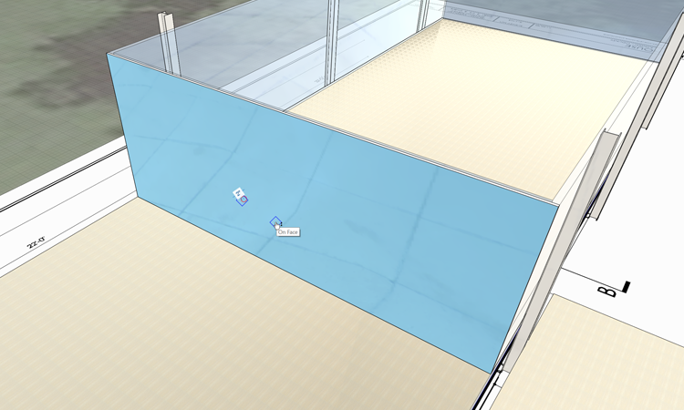
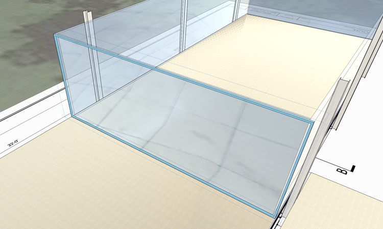
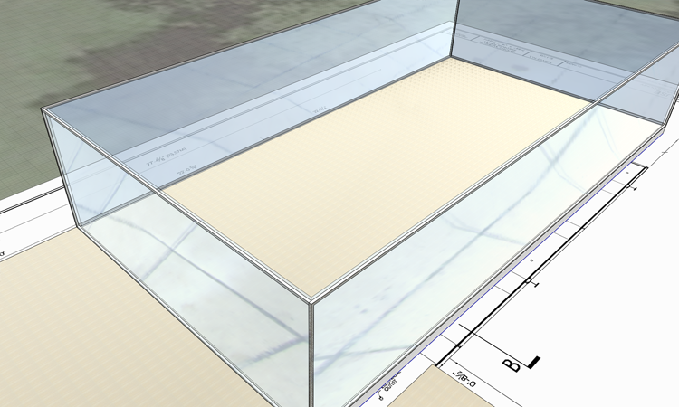
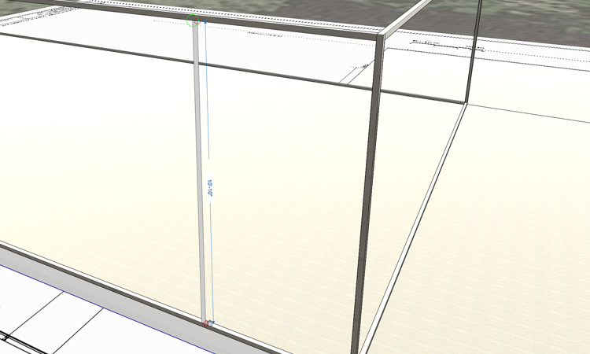
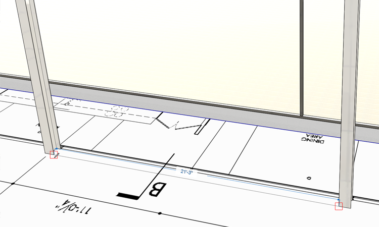
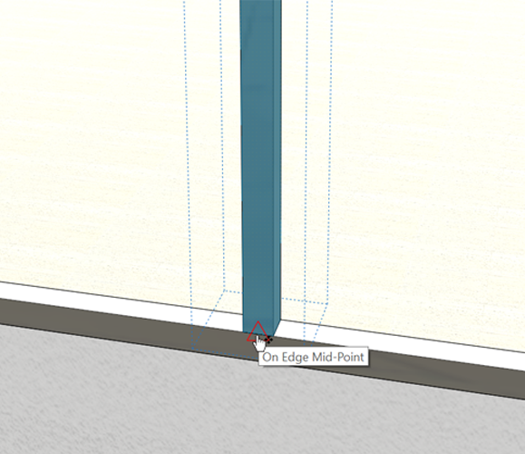
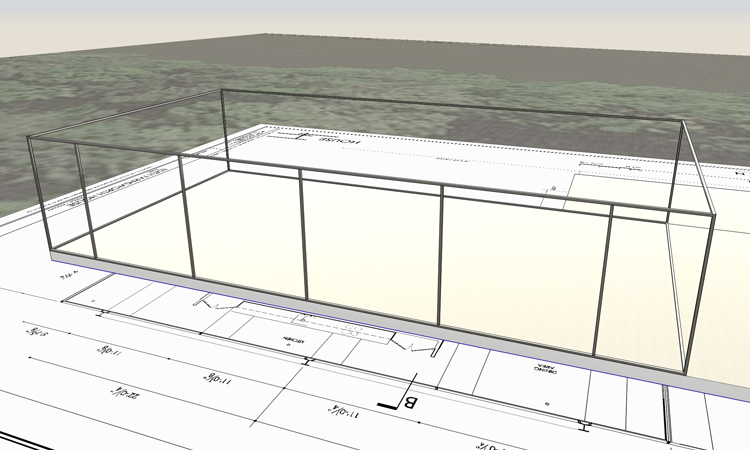

# Adding Details

FormIt is a great massing tool - as well as a great modeling tool. We'll start to add detail to the Farnsworth house in the form of doors and mullions for the glass box. We'll cover some additional tools, and practice the process of adding new geometry, layers, materials, and group management.

If you did not complete the last section, download and open the **farnsworth04.axm** file from the [FormIt Primer folder](https://autodesk.app.box.com/s/thavswirrbflit27rbqzl26ljj7fu1uv/1/9025446442).

## Create Window Frames

We are going to create a 2" metal frame and mullions around the glass box. These mullions will overlap with the glass box. This is intentional

1. Create a new layer called **glass walls** and put the glass box group onto this layer.
2. **Turn off** the **Roof** layer so we can see the entire glass box. Turn on the **North Arrow** with the **DN** keyboard shortcut.
3. Use the [**Rectangle tool \(R\)**](../../tool-library/rectangle-tool.md) to draw a surface over the western face of glass.  _**Note**: Since the glass box is grouped, draw this rectangle outside the Group, so this new rectangle will **not "stick"** to the glass box._
4. **Single-click** to select the new face, then **single-click** to start a drag face. **Push** the face 2" towards the interior. Click **Esc** to clear the selection.
5. If you have trouble selecting the new face, turn off the **glass walls** layer, or hover on the face. Hit the **space bar** to choose different selection candidates.

   

6. **Single-click** the face you just created. **Right-click** to access the context menu. Use the [**Offset Face tool \(OF\)**](../../tool-library/extrude-cut-and-offset-faces.md)**.**
7. Move your mouse toward the inside of the face. Hit the **Tab key** and enter **2"** to create a new rectangle. Click **Esc** to clear the selection.
8. **Single-click** to select the interior rectangle you just created. Click again to start a drag face. **Push** this face through the model to remove it.
9. **Double-click** to select the mullion frame. Add the selection to **Group \(G\)**.

   

10. Create a layer named **mullions** and add it to the new group.
11. Edit the mullion group by **double-clicking** it. Name it **EW Frame** under the **Properties palette.**
12. Import and paint the **mullion group** with the material **Metal &gt; Anodized – Gray.**
13. **Quick copy**, **Array** or **Mirror** the mullion to the eastern side of the building.
14. Repeat the steps above for the **North and South** sides of the glass box.

    

You may want to turn off the **columns** layer. The mullion frames will overlap each other at the corners. This is intentional.

## Create Mullions

1. Turn off the **glass walls** layer. **Orbit** the camera so you're viewing the **North** side of the glass box.
2. Draw a **Rectangle \(R\)** vertically between the top and bottom of the frame. The rectangle should be **2" wide and 10' 10" tall.**

   

3. Push the face inward 2" to make a mullion.
4. **Double click** to select the mullion. **Group \(G\)** and name the group **mullion**. Put the mullion on the **mullions** layer.
5. Paint the mullion with the material **Metal &gt; Anodized – Gray.**

## Locate Mullions

We want this mullion to appear at the midpoint between the columns. We'll draw a 'guideline' to help us locate the mullion correctly.

1. Turn on the columns layer. Draw a guideline with the **Line \(L\)** between the end points of two columns - the distance should be **21' 3".**

   

2. **Single click** to select the mullion group. **Zoom in** and pick the **mid point** of the mullion as the **move start point**. Zoom out from this view.

   

3. Move your cursor to the left, along the **red axis**. Hold the **Shift** key to lock the axis.
4. With the **Shift key** down, move your mouse to find the **midpoint** of the guideline. Now click to place the mullion.

   

5. Press **Esc** to clear the move tool. Now select the guideline and delete it.
6. Select the mullion, **single-click** to start the move tool. Move your mouse to the right, along the **red axis**. Click the **Ctrl** key to make a **quick copy**. Press the **Tab key** and input **11'** to the right of the original.
7. Select the original mullion, and [**Array**](../../tool-library/tilt-array-copy-and-paste.md) it three times at a **distance between** of **11'.**

   

8. **Hover the mouse** over a mullion, hit the **Tab key** to highlight, then **click** to select all mullions. Use **Mirror** or **Array** or **quick copy** to copy these to the south side of the wall.

## Create the Door Mullions

Draw 2" mullion frames for double doors \(using similar steps as the previous exercises\) at the center of the Western wall. The doors should be 3'-6" each. The results should be similar to the picture below.

## Related Topics:

[**Cover Sweep Loft**](../../tool-library/cover-sweep-loft.md)

