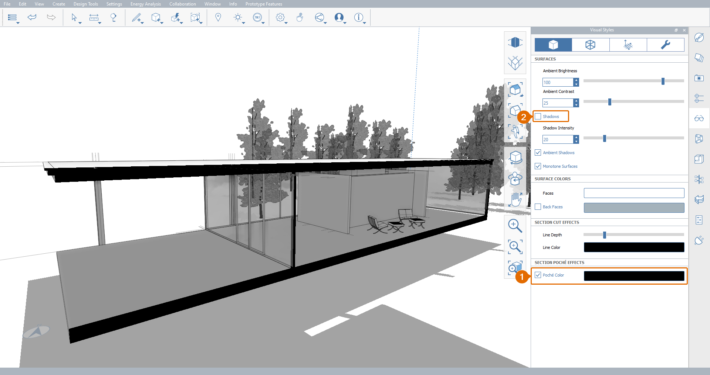

# 1.13 - Section Planes

_In this chapter you will learn how to use_ _**Section Planes**_ _to cut your model, revealing interior spaces and structural elements. FormIt supports multiple_ _**Section Planes**_ _at once for a Section Box-like effect._

_If you did not complete the previous chapter, download and open the_ _**1. 13 - Section Planes.axm**_ _file from the_ _**FormIt Primer Part 1 Datasets**._

1 - To create a new Section Plane:

1. Click on the **Section Plane \(SP\)** button from the **Standard Toolbar**.
2. Hover over the model to identify a plane to use as reference. Note the arrows at the corners of the **Section Plane** indicating the direction of the section cut. Press the **Tab** key to alternate between different planes, if needed.
3. Click to place the **Section Plane** anywhere on the southern glass wall of the main building. The plane will scale to the size of your model and remain selected.

2 - With the section plane still select, click to start moving it backwards until it is cutting through part of the main building, similar to the image below. This works similarly to moving any model element, except that the section plane can only move along an axis perpendicular to the direction it is facing. Once you are happy with the position, press **Esc** to clear the selection.

_**Note:**_ _You can add up to 6 section cuts to your model at once._

3 - Open the **Layers** **Palette**. Note that two \(2\) new layers have been generated - **Section Indicators** and **Section Cut 1**.

1. Toggle the **Section Cut 1** layer off and back on. This controls whether the section cuts the model or not.
2. Now toggle the **Section Indicator** layer off. This hides the section plane and its arrow indicators, but does not affect whether the actual section cut is active or not.

4 - In the **Surface Tab** of the **Visual Styles** **Palette**:

1.  Check the box next to **Poche Color** to turn it on. This effect will color any solids cut by the section plane with a specified color. Black is the default color, but you can simply click on the color preview to change it.
2. Turn of **Shadows \(DS\)**.

5 - To finalize your section, go to the **Scenes Palette** and create a new Scene called **Section**, saving the current **Camera** position, **Layers** visibility, and **Visual Styles** settings.

