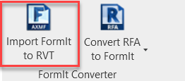
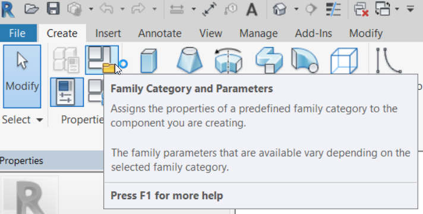
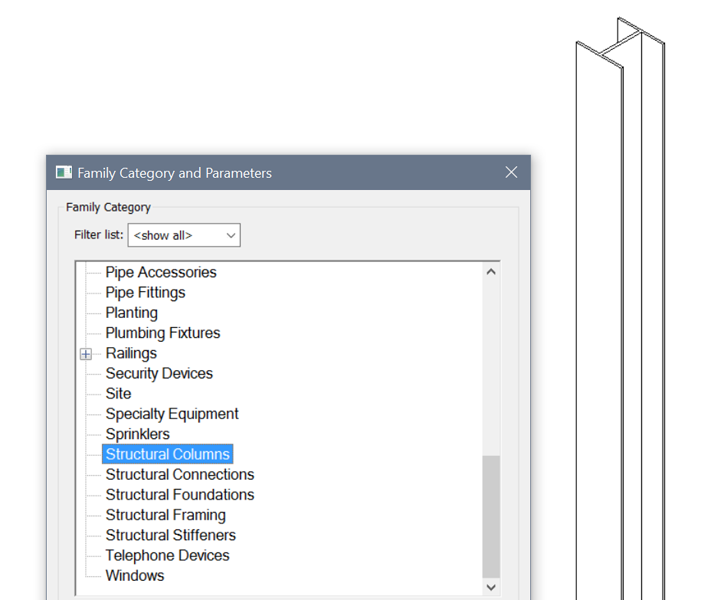
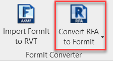
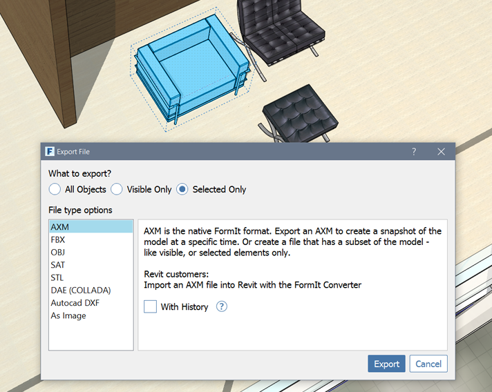
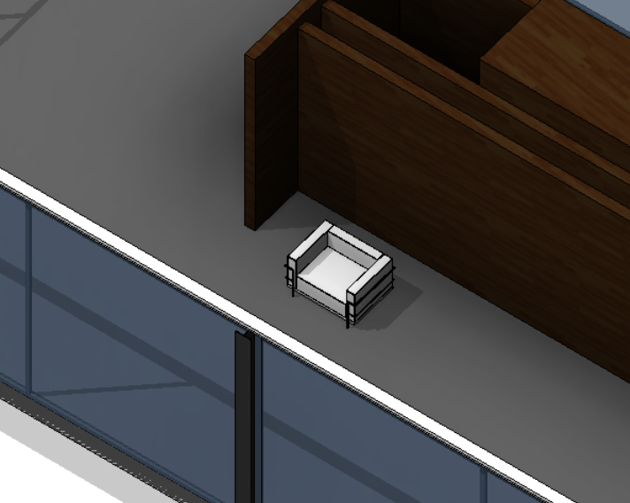
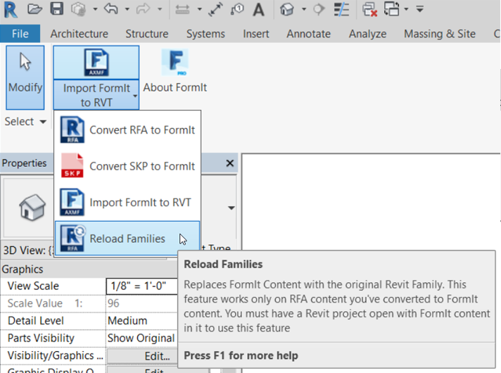
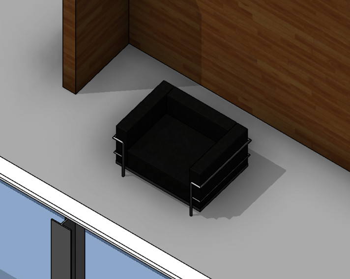
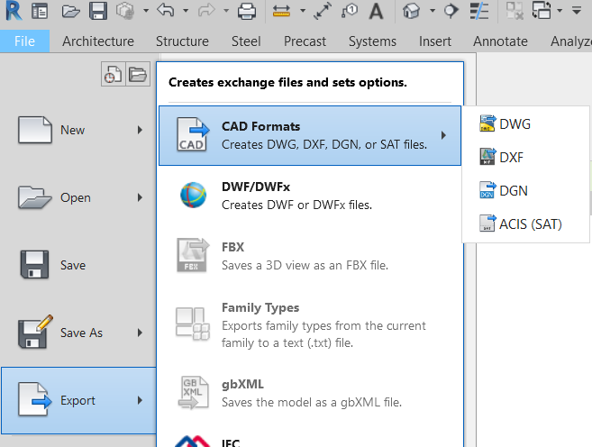

# Working with Revit

One of FormIt's most exciting features is the ability to move your model from a flexible modeling environment like FormIt, to a powerful parametric environment like Revit. We'll go through a few exercises that move elements from FormIt to Revit, and from Revit to FormIt.

If you did not complete the last section, click the File &gt; Open and choose **farnsworth09.axm** from the FormIt Primer folder.

## Import Data from FormIt into Revit

In this exercise we will use Revit 2021 which has improved importing capabilities, as well as the ability to import materials from FormIt! Previous versions of the FormIt Converter do not have these features

1. Open the **farnsworth09.axm** file in FormIt. The **plan image** and the **furniture** layers are turned **off**
2. Only visible objects from the FormIt model will be imported to Revit in order to save processing time. This also gives you control over what is imported
3. Start **Revit 2021**. Start a new project from an **Architectural template**
4. Go to the **Add-Ins** tab. Select **Import Formit to Revit** in **FormIt Converter** panel. 

   

5. Choose **farnsworth09.axm** from the FormIt Primer folder.
6. This process will take a minute. Revit converts each FormIt group into a family of the category we specified in FormIt.
7. If there are any errors importing FormIt geometry, then Revit will list those. You can go back to FormIt and investigate these groups.
8. Go to the **default 3D view**, and turn on **Realistic visual style**. Our model has been imported with materials applied!

   

If you do not see some of the **Mass geometry** then you may need to enable the **Mass** category in the **Visibility Graphics \(VG\)** dialog. You can now Render, create Elevation views, and other presentation drawings!

## Revit Conceptual Mass Tools

In order to turn your Mass elements into Revit elements, we'll discuss the **Massing and Site** tab in Revit. Find the **Conceptual Mass** and **Model by Face** panels. These tools allow you to turn FormIt Masses into Revit BIM elements

1. Select the **lower terrace**. Select the **Mass Floors** button from the ribbon. Check the **Terrace** level from the dialog that appears

   

2. Click the **Floor by Face** tool from the **Massing and Site** ribbon. Hover over the edge of the lower terrace, it highlights blue - click to select it.
3. Click the **Create Floor** button in the Ribbon. The Revit floor is created **below** the FormIt floor.
4. While the Revit floor is selected, look in the **Properties panel**, change the **Height Offset from Level** parameter to be **1' 0".**
5. Turn off the **Mass** category in the **Visibility Graphics \(VG\)** menu in order to see just Revit geometry
6. Repeat these steps for the **upper floor**, but choose the **Floor 1** level when creating a Mass Floor

You can apply **Wall by Face**, **Roof by Face** and **Curtain System by Face** to build up your Revit model using the FormIt model as a reference.

## Change Revit Family Category

In the previous section we learned what to do with **Masses** from FormIt. In this section we'll show you a technique to manipulate FormIt groups using the **Revit Family Editor**

1. Notice that the Columns imported from FormIt as **Generic Model** category families. But we want them to be categorized as **Structural Columns.**
2. First select one of the **tall column** families. From the ribbon, choose the **Edit Family** button.
3. This will open the Revit **Family Editor**. Click the **folder icon** in the upper left corner to launch the **Family Category and Parameters** dialog.

   

4. Scroll down the list of Categories and choose **Structural Columns**. Click OK to confirm, and exit the dialog.

   

5. Choose the **Load into Project** button from the Ribbon.
6. Revit asks you to confirm the reload, choose to **Overwrite the existing version**
7. Confirm the category change by hovering your mouse over the tall columns. The **tooltip** reports the category of the family
8. Repeat these steps for the **short column** family
9. Verify the columns are behaving correctly by turning off the **Structural Columns** category in the **Visibility Graphics \(VG\)** dialog
10. Save your Revit file as **Farnsworth.RVT** as we'll need this file for the next few exercises

This technique allows you to flexibly adjust the category of groups from FormIt. One caveat, if your group is a **Mass** when imported from FormIt, you cannot change to another category using this technique - you have to set the category to **Generic Models** in FormIt first

## Convert Revit Families for Use in FormIt 

If you \(or your firm\) has a trove of Revit Families that you want to use in FormIt, then you'll be interested in the next section which discusses how to export RFA to FormIt, and then replace them with the original RFA when importing back into Revit.

The steps below are for **your reference**. These files have already been converted for you! We used them when we placed the **Corbu Chair** previously.

1. Open **Revit 2016, 2017, or 2018** and start a new file from the Architectural Template.
2. From the Add-Ins tab, find the **FormIt Converter** and select **Convert RFA to FormIt**  from the drop down.

   

3. Set the first path \(location of the Revit RFA\) to **FormIt Primer\content\RFA.**
4. Set the second path \(location the FormIt files will be saved to\) to **FormIt Primer\content** and click OK.
5. This process will take a number of minutes as Revit opens each RFA in the first path - then converts, and saves it as an AXMF format for FormIt.
6. Once the process is completed you can go to FormIt and link to the folder of **content** following [these instructions](import-export-and-content-library.md)

**Note**: _Not all categories from Revit are supported for export. The 'free standing' families are supported, but the 'host based' families are not. Mass, Casework, Entourage, Furniture, Furniture System, Generic Model, Parking, Site, and Specialty Equipment are all supported_

## Export Selected from FormIt

In this exercise we'll cover a powerful tool in FormIt called **Export Selected.** After, we'll explore the **Reload Families** feature in Revit.

1. Open the **farnsworth09.axm** file in FormIt. Turn on the **furniture** layer, and turn off the **roof** layer.
2. Select the **Corbu chair** that we placed in an earlier exercise.
3. Choose **File &gt; Export \(Ctrl + E\)**. The dialog defaults to choose AXM from the list on the left - this is what we want.
4. Choose the **Selected Only** option from the list along the top of the dialog.

   

5. Click the **Export** button, and save the file on your system. Name it **Chair.AXM.**

## Reload Families in Revit

1. In Revit, open the the **Farnsworth.RVT** file.
2. Choose to **Import FormIt to Revit**. Choose the **Chair.AXM** file from the previous steps.
3. You can **hide** the roof by selecting it, right click, and choosing **Hide in View &gt; Element.**
4. Revit will import the geometry, and place it in the correct location relative to the previously imported geometry. The origin point of the FormIt and Revit file are in sync.

   

5. This imported chair is NOT the original RFA yet. We have to perform one more step. Go to the **Reload Families** option in the **FormIt Converter** Add-In.

   

6. In the dialog, input the path to the folder containing the original RFA **FormIt Primer\content\RFA.**
7. Revit will swap out the FormIt version for the original RFA.

   

## Export Walls, Floors, Windows from Revit to FormIt

If you want to export Revit model elements \(like Walls and Floors\) for use in FormIt \(as a reference, or design iteration\), you can Export a 3D scene to the SAT file format. SAT files can be imported to FormIt directly and quickly.

A few tips to make this process work well

1. Work in a default 3D view in Revit
2. Turn off all of the categories in the Revit view, then turn on **ONLY** the categories you need. The SAT export brings visible elements only.
3. Use **Temporary Hide Isolate** or filters to export specific elements. **Section Box** does not work to filter out elements for export.
4. When you **Import SAT** models to FormIt, they will appear in the same location relative the origin point in **Revit**. This makes going back and forth between the applications easier.
5. If you want to import a **large** Revit model to FormIt, then turn on only one category at a time. Export just that category to SAT. Import just one SAT at a time to FormIt and put that import on a **layer**. This process will keep elements isolated from each other. Repeat for as many categories you want.

   

**Note**: _Family and category information is not transferred back to FormIt when exporting to SAT._

