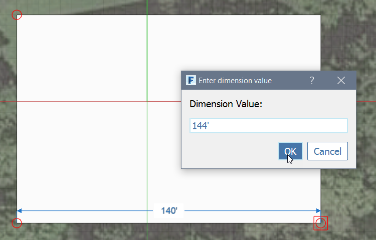
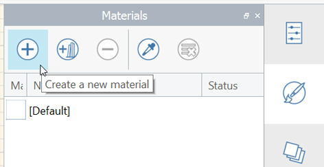
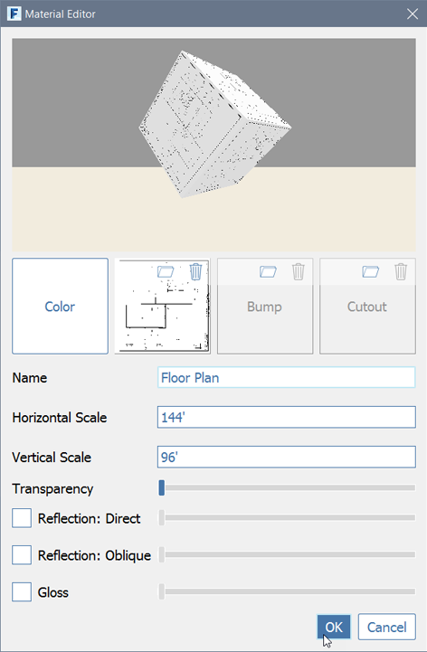
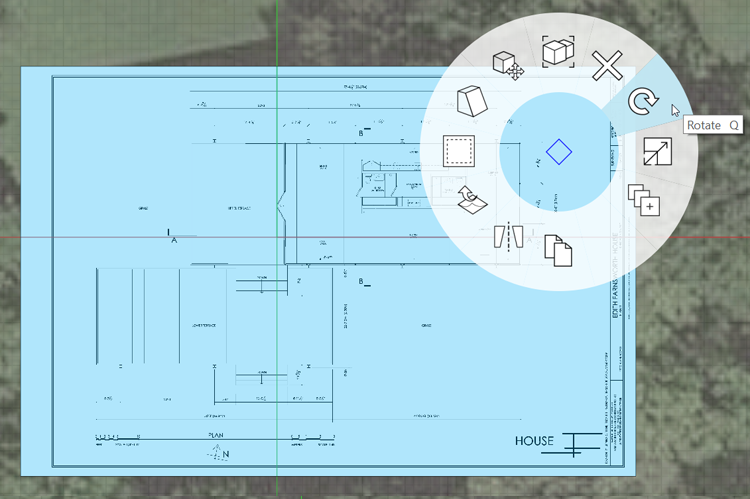
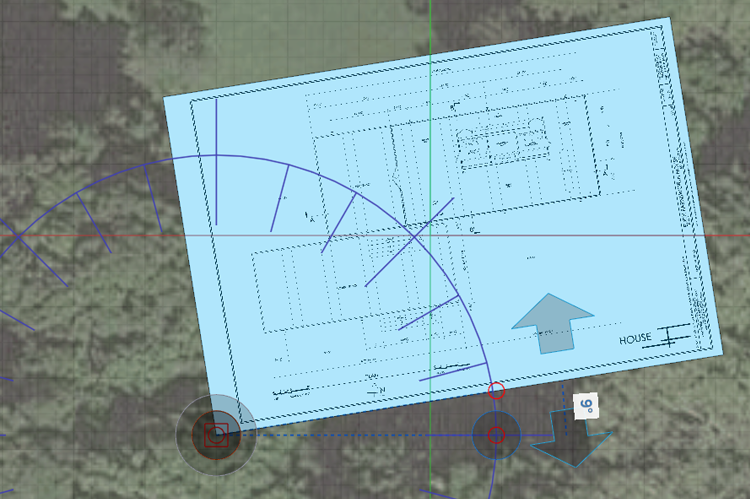
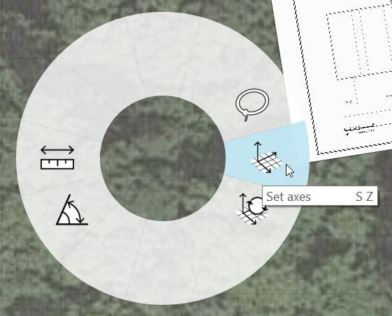
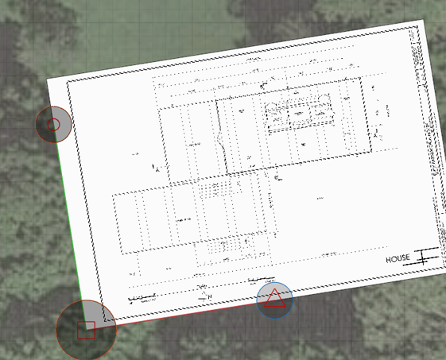
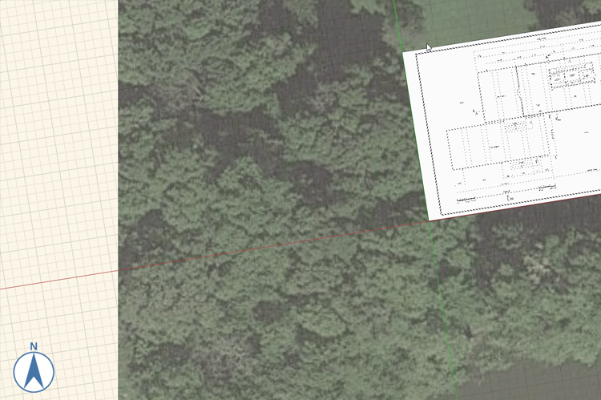

# Project Set Up with Images and Grid

You may import PNG or JPG images onto the ground plane by using the File &gt; Import menu. However, to gain more control over the scale and position, we will create a custom material and apply it to a rectangle that we will draw ourselves. The **plan.png** image is 3600 pixels wide by 2400 pixels high. By measuring the scale on the plan, we see that 1' is 25 pixels. This will allow us to scale the image properly.

## Import an Image to scale

1. Click the Top View icon from the Navigation Bar to see the scene from above

   

2. Choose the [**Rectangle tool \(R\)**](../tool-library/rectangle-tool.md) from the 3D Sketch toolbar and draw a rectangle **144'** by **96'**

   

3. While the dimension is visible, simply start typing a value to access a dialog where you can input exact dimensions. Click **OK** to commit the dimension. Click **Esc** to clear the Rectangle tool

   

4. Open the [**Material Palette**](../formit-introduction/tool-bars.md) and click the **+** icon to create a new material

   

5. Name the new material **Floor Plan**
6. Import the image texture. Find the Texture preview tile and click the **folder icon**, browse to **plan.png** in the **FormIt Primer release\Part 1 datasets\drawings** folder, click OK
7. Change the scale of the image. Enter **144'** in the Horizontal field and **96'** in the Vertical field, click OK to finish the material

   

8. In the [**Material Palette**](../formit-introduction/tool-bars.md) **single click** on the **Floor Plan material** tile to paint with this material
9. Click on the **rectangle** you sketched to paint it with the material. Click **Esc** to clear the paintbrush tool
10. If the material appears inverted, or backwards, you may need to Flip the Face \(single click to select the face, and type FF keyboard shortcut\)

## Align the Imported Image to the Satellite Image

1. Now we'll rotate the rectangle to align with the Satellite image. **Double-click** the **rectangle** to select it
2. **Right click** to bring up the context menu. Choose [**Rotate \(Q\)**](../tool-library/rotate.md)

   

3. The Rotate widget appears in the middle of the rectangle. Select the widget by clicking once on the orange grip in the middle. Move the widget to the bottom left corner of the rectangle. It will snap to the corner. Click to place it
4. Type **9**, and the dimension box will appear. Click OK to rotate the rectangle counter-clockwise

   

## Align the Grid to the Satellite Image

1. Now we will align the grid with the Satellite image and the floor plan. **Right click** on the **ground plane** and choose [**Set Axes \(SZ\)**](../tool-library/world-axes.md).

   

2. The Set Axis widget appears. Move the axis to the bottom left corner of the of the rectanle. Click to place it
3. Click the grip at the end of the red axis. Move the grip so that it snaps to the bottom edge of the plane. Click off in space to commit this change

   

4. The satellite image, the rectangle and the grid are now aligned – which will make 3D sketching much easier

   

