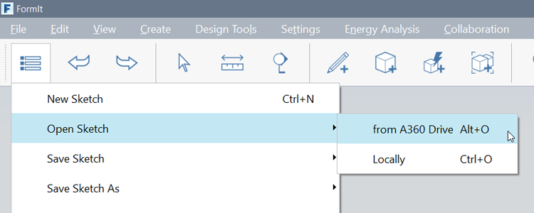
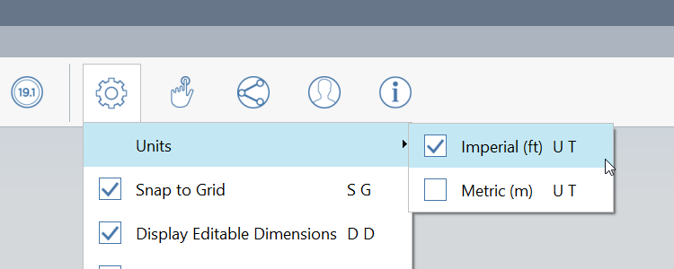

### Setting Up the Project

FormIt provides two ways to save your work

1. You can also open, save, import and export files from a local drive. 

2. Or, you can save your work to A360 Drive. This will allow you to share data outside of your office.

We will use local saving for loading datasets in the FormIt Primer, but you can use your A360 drive account to log into FormIt and save your work as you move through the course.

### Saving Your Work

1. After downloading and installing FormIt following the directions found here, open the program

2. **Log into FormIt** using your own Autodesk 360 credentials in the [**User Identity menu in the Action Tool Bar**](../formit-introduction/tool-bars.md)

   

3. Start a new 'sketch' by clicking the **File button &gt; New **

   

4. Click the **File button &gt; Save Sketch &gt; to A360 drive** to save this to the FormIt folder in your A360 Drive

   

5. Name your FormIt Sketch

6. Each time you save to A360 two things happen:

   * A FormIt AXM file is saved to the FormIt folder in A360
   * An RVT file will appear in the FormIt folder in A360. We will review [**another way to bring FormIt into Revit**](../Building-the-Farnsworth-House/Revit-Interop.md).

7. Change the **Units** between Imperial and Metric using the [**Settings Menu in the Action Tool Bar**](../formit-introduction/tool-bars.md)

   

