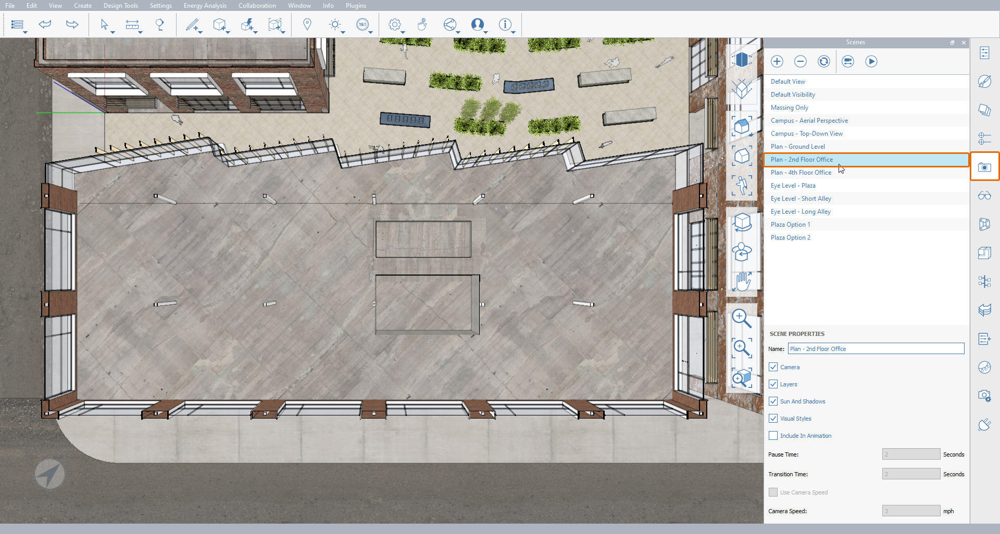
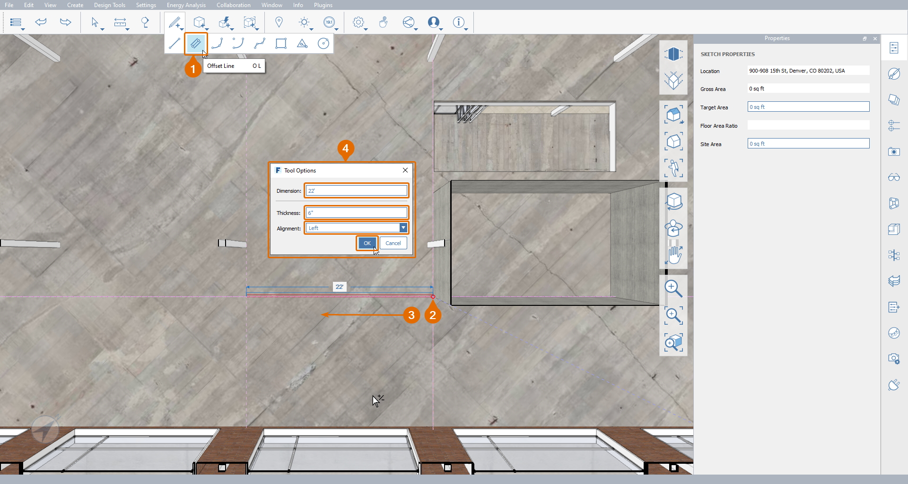
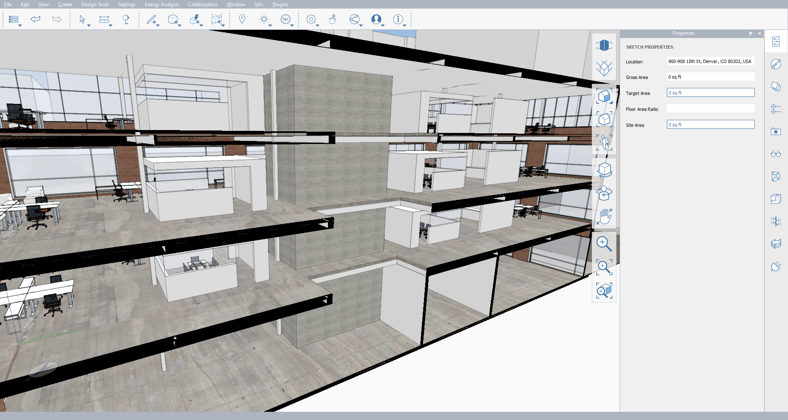

# 2.1 - Offset Line Tool

_The_ _**Offset Line \(OL\)**_ _allows you to draw lines with a defined thickness. You can set the offset width and justification direction, making this tool an easy way to trace plans, create walls, draw roads, or quickly make any other linear-based shape with a set thickness._

_In this exercise, we will add some interior partitions to the_ _**Encode Campus Sample Model.axm**. If you have not already, you can download the file from the_ _**FormIt Primer Part 2 Dataset**._

## Drawing Walls

_First, we will draw a few walls on the 2nd Floor office space using the_ _**Offset Line \(OL\)**_ _tool._

1 – After opening the _**Encode Campus Sample Model.axm**,_ let’s orient the current view to a plan view. From the **Scenes Palette**, double-click on the scene named **Plan – 2nd Floor Office**.

_**Note:**_ _Using scenes to control both the camera position and the visibility of section layers is an efficient way to navigate the model. For more information on Sections, check out the_ _**Section Planes**_ _chapter from the **FormIt Primer Part I.**_

2 _**-**_ To start the first wall of what will be a small conference room:

1. From the **Standard Toolbar**, click on the **Create Sketch** button \(pencil icon\) and select the **Offset Line \(OL\)** tool.
2. To start drawing the walls, single-click on the bottom left corner of the shaft.
3. Start dragging the mouse to the left along the green axis \(**X axis**\), then press the **Tab** key or start typing a dimension.
4. The **Tool Option** dialog will appear, where we can set not only the length of the offset line, but also its **Thickness** and **Alignment**. For the **Dimension**, type **22'**.For the **Thickness**, type **6”**. For the **Alignment**, select either **Left** or **Right** from the dropdown, so that the bottom edge of the offset line is flush with the shaft wall as shown in the below image. Then click **OK.**

_**Note:**_ _If you want to modify the default_ _**Thickness**_ _and/or the_ _**Alignment**, without entering a_ _**Dimension**_ _in the_ _**Tool Option**_ _dialog, simply delete the value from the_ _**Dimension**_ _field before pressing_ _**OK**. You will be back in the model with the_ _**Offset Tool \(OL\)**_ _still active. Now you can click in the model to define the next end point of your offset line._

3 - To draw the rest of the walls for the conference room

1. Without exiting the **Offset Line \(OL\)** tool, draw a shape matching the dimensions shown in the image below. To create each segment, either use the **Tab** key or just start typing to enter the desired length of each edge.
2. The direction of the **Left**/**Right** offset is based on the direction of the polyline you are drawing, and therefore may flip while you are in the process of drawing the entire shape. If this happens, simple press **Tab** and switch the **Alignment** dropdown between **Left** and **Right** as needed.
3. To complete the Offset Line command, double-click at the location of your final endpoint, which should intersect the first line you drew. Don’t worry if the offset lines you just drew disappear when you double-click, we will find them again in the next step.

_**Note:**_ _Remember, you can always switch between_ _**Orthographic \(VO\)**_ _and_ _**Perspective \(VP\)**_ _camera modes to make drawing easier. However, some elements perpendicular to the camera may not be visible is Orthographic mode._

_**Note:**_ _When using the_ _**Offset Line \(OL\)**_ _tool, don’t worry if you create any overlapping or intersecting paths. As soon as you finish the command, all the lines will be merged into one clean surface, and any extra inner edges will be removed._

4 - If the offset line you just created is not visible, it is because the new surface you just made is in the exact same plane as the office’s floor. Orbit the view slightly until you see the offset lines you just drew clashing with the floor surface. Select it by single-clicking anywhere on the face.

_**Note:**_ _If you are having trouble selecting this new surface, either use the space bar to cycle through selection options or temporarily turn off the_ _**Encode Main Building – Floors**_ _layer._

5 - Extrude the shape **8’-0”** vertically to create the walls.

6 - Feel free to populate this office floor by drawing and extruding more walls to get more familiar with the **Offset Line \(OL\)** tool. You may need to alternate between the **Plan – Second Floor Office** scene and a 3D view, as we did above. When you are ready, take a look at the next sections to see a few more creative uses for this tool.

## Making a Door

_The_ _**Offset Line**_ _**\(OL\)**_ _tool does not need to be used exclusively in plan. Below we will use it to make a quick doorway._

1 - First, position your 3D view so that you can see where the longest wall we drew meets the exterior corner of the shaft, similar to the image below. If you are having trouble, start from the **Plan – Second Floor Office** scene we used earlier, or ensure that the **Section – 2nd Floor Office Plan** layer is still turned on.

2 - Often times, doorways are located based on their center line, not their jambs. Let’s use the **Offset Line \(OL\)** tool to create a door opening by its center point:

1. First we will mark the doorways center point. Use the **Line \(L\)** tool to draw a **3’** line from the bottom corner of the shaft along the bottom edge of our new wall as shown.
2. Start the **Offset Line \(OL\)** tool again.
3. To start drawing the door, click on the endpoint of the line we just drew. This will ensure that the center of our doorway is **3’** from the shaft wall.
4. Drag the mouse up along the blue axis \(**Z Axis**\), and the press the **Tab** key. Enter a **Dimension** of **7’**, a **Thickness** of **4’**, and set the **Alignment** to **Center**. Then click **OK** to create that segment. Press **Esc** to finish and exit the **Offset Line**.

_**Note:**_ _If you are having trouble getting this single-segment offset line to be in plane with the wall, it is likely caused by your current axis. Use the_ _**Set Axes \(SZ\)**_ _tool to reset the axes directions relative to the_ _**Plan – 2nd Floor Office**_ _scene – so that green axis \(**X Axis**\) is pointing to the left and red axis \(**Y Axis**\) is pointing up._

3 - To turn the doorway outline into an opening, single-click on the face we just made, and drag it back through the wall until it disappears.

## Getting Creative

1 - Next, we will add some more entryways to the conference room along with a sweeping window, all using a single Offset Line!

1. Start the **Offset Line \(OL\)** tool again, and choose a starting point along the base of the same wall approximately **10’** to the left of the corner of the shaft.
2. Start dragging the mouse up along the blue axis \(**Z Axis**\) again, then press **Tab**.
3. This first line will be another doorway. Enter a **Dimension** of **5’-6”** again. This time set the **Thickness** to **3’** and make sure the **Alignment** is still set the **Center**. The click **OK.**
4. To make the horizontal strip for the window, drag the cursor along the green axis \(**X Axis**\) towards the conference room’s far corner.
5. Hold **Shift** to lock to the green axis \(**X** Axis\) and then click anywhere along the exterior corner of the wall. Press **Esc** to finish the Offset Line.

2 - To finish up, let’s cut the conference room walls with the shape we just created, and then add some glass. Select the L-shaped surface we just created by single-clicking on it. Then, drag it backwards past the farthest conference room wall so that it cuts 3 walls at once.

3 - Now to add some glass:

1. Using the **Line** tool, create a total of four \(4\) vertical lines as shown; one at each of the open corners, and one at the edge of each new doorway openings. In doing so, FormIt will create three \(3\) new surfaces for us.
2. Paint these three \(3\) surfaces with the **Glass - New** material from the **Materials Palette**.
3. Let’s not forget to keep our model organized, as that is always a good practice. Group all the geometry we just created – glass and walls – together in one group. Name it **Conference Room** and place it on the **Encode Main Building – Interior Partitions** layer.

4 - The final step is up to you! Be creative, and you can take this project anywhere you want with FormIt. In the below image, we added some furniture and a ceiling to the conference room, mirrored a copy of the conference room group to the opposite side of the shaft, added another 'pod' area, and populated the floor with office furniture. We then arrayed that geometry to all of the the office floors:

