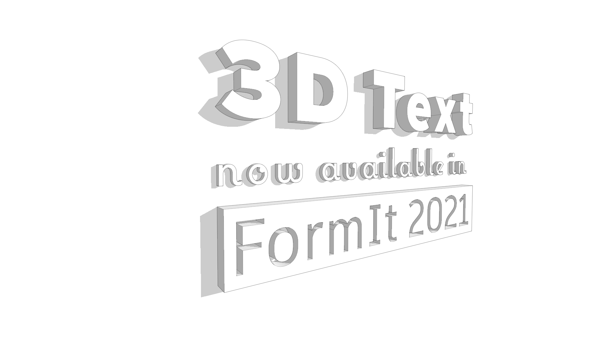
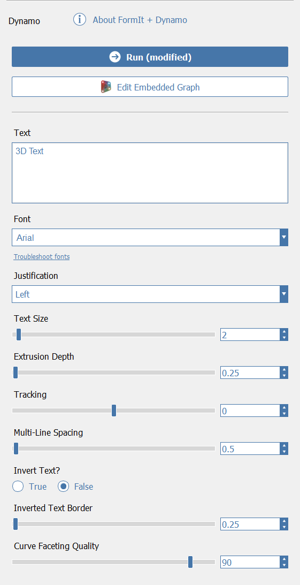
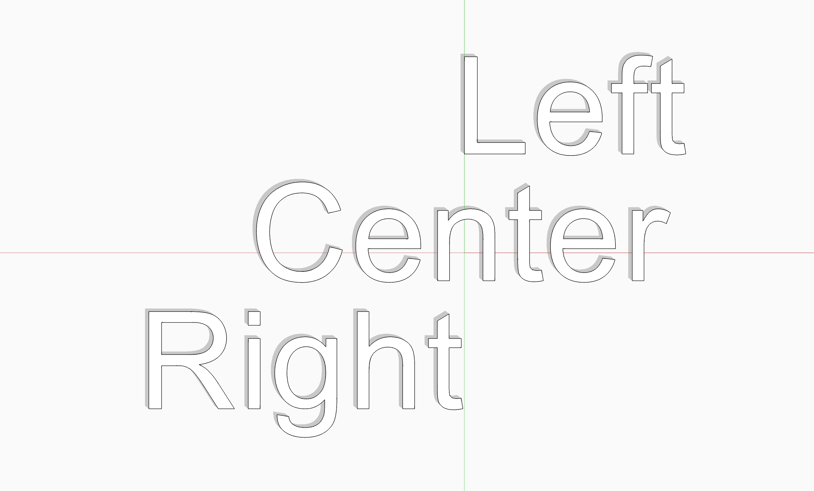
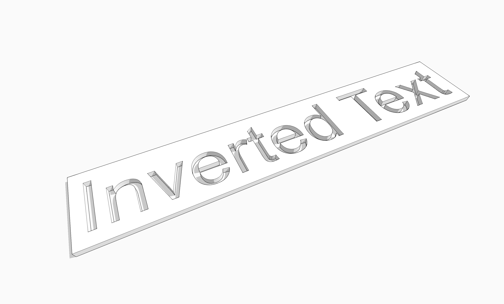
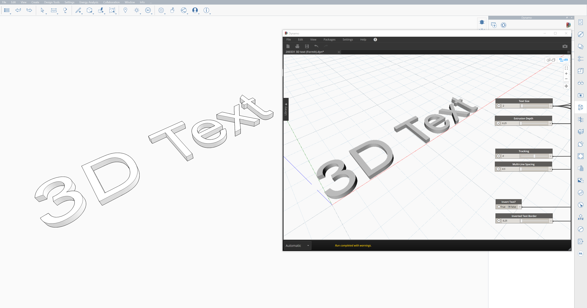

# 3D Text

## Powered by Dynamo

In FormIt 2021 and newer, you can generate and modify 3D Text objects, which are powered by Dynamo. Dynamo enables editing the font, size, and other properties of the text in-place, without having to re-generate and re-position the text when edits are needed.

## Placing 3D Text

* Go to the Dynamo panel in FormIt for Windows, and ensure you're in the Dynamo Samples directory
* Click the 3D Text sample
* Move your cursor to the canvas, and you'll see the 3D Text appear on your cursor
  * Before placing, you can hover over geometry to orient the 3D Text differently - for example, on a vertical surface to get the text to align itself vertically. You can also hit Tab to cycle between orientations.
* Click to place the 3D Text, which will be generated inside a FormIt Group.
* After placing, the Properties panel will show up to reveal the available options for 3D Text.

## Iterating In Place

The beauty of using Dynamo to generate 3D Text is that editing it is easy, and keeps the text in its current position, for quick iteration.

3D Text options are available in the Properties panel when the 3D Text Group is selected, or when editing the Group. 

After placing the 3D Text initially, the Properties panel will be displayed automatically. You can also select the Group and switch to Properties yourself, or double-click the Group to automatically switch to the Properties panel.

### Run

After editing the options, click the "Run" button to run the underlying Dynamo graph, and generate new results. This button will turn blue when parameters have changed, so you know that "Run" needs to be clicked to see the updates in the final geometry.‌

### Edit Embedded Graph

Clicking this will launch the Dynamo graph editor environment, so you can view and edit the underlying Dynamo graph to quickly change parameters and see live updates, or to inspect/adjust the logic. This isn't required but can be useful for troubleshooting or for faster editing. [Learn more](https://windows.help.formit.autodesk.com/tool-library/3d-text#iterate-faster-in-dynamo). 

### Text

Enter the text you'd like the 3D Text geometry to display. This field also previews the selected font and justification. Hit Enter/Return to have multiple lines. 

### Font

Select the font for the 3D Text. This list will display the fonts available on the machine, and selecting a new font will update the Text field. 

Note that some fonts have more complex geometry, and may take more time to generate using Dynamo.

### Justification

This will move the text to align relative to the Group's Local Coordinate System origin. 

* Left will ensure the text starts at the Group's origin, and expands to the right
* Center will ensure the text is always centered about the Group's origin
* Right will ensure the text ends at the Group's origin

### Text Size

The height of the text, in the current FormIt units.

### Extrusion Depth

The amount of 3D extrusion of the text, in the current FormIt units. 3D Text is designed to be solid, so this value can't be zero, but you can get it very close to 0 so it's less obvious that it's extruded.

### Tracking

Tracking is useful to adjust the default spacing between letters from a particular font. Uses the current FormIt units, and can be positive or negative. For example, in Feet, 0.25 will add 3" of spacing between each letter. Conversely, -0.25 will make all the letters 3" closer. 

### Multi-Line Spacing

If you have multiple lines in the Text field, this value controls how much space is between each line of text. Uses the current FormIt units.

### Invert Text

When True, this option will create a solid around the text, and will remove the text from it, giving the result of "inverted" text - as if the text was cut out of a material. 

### Inverted Text Border

Only applies when Invert Text is true. Specifies the amount of border around the text to use for the solid from which the text is removed. Uses the current FormIt units.

### Curve Faceting Quality

Curves from fonts are converted to line segments using 3D Text, so this value controls how fine the curves are faceted. 

Lower numbers will result in more coarse faceting \(longer segments\) and higher numbers will result in finer faceting \(shorter segments\). This value overrides FormIt's Curve and Surface faceting settings in Preferences.

## Iterate Faster in Dynamo

If you're iterating on 3D Text options, it might be faster to launch the Dynamo graph editor, which will allow you to adjust parameters and see the changes in real-time. This also allows you to inspect the logic behind the graph, in case there are issues. 

You can click the "Edit Embedded Graph" button in the Properties panel, to start the Dynamo graph editor.

## Troubleshooting

3D Text uses Dynamo behind the scenes, and Dynamo uses a modeling kernel called ASM to generate its geometry, which is passed back to FormIt. 

Some fonts may create "self-intersecting curves", or other problematic geometry, which cause errors in ASM. 

If you get an error when trying to run 3D Text, or if letters disappear, it's worth clicking "Edit Embedded Graph" to see what's going wrong with the graph, and where the failure might be happening. 

Some fonts also have known issues that prevent them from being turned into proper geometry. Bahnschrift is one example of this. If you run into another font that's problematic, [let us know on the forums](https://forums.autodesk.com/t5/formit-forum/bd-p/142). We'll do what we can to fix issues with specific fonts.

