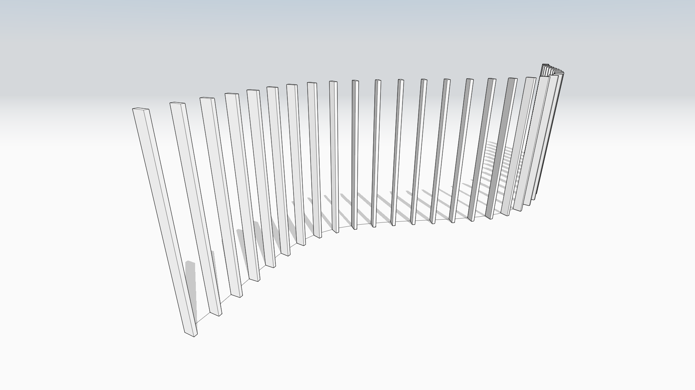
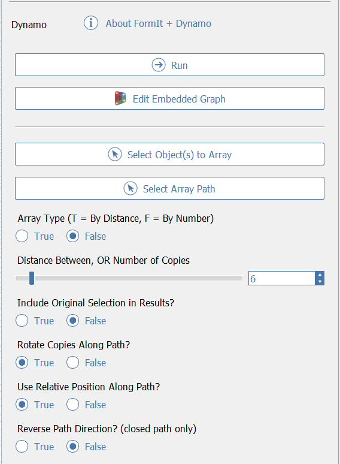

# Array Along Path

## Powered by Dynamo

In FormIt 2021 and newer, you can array objects along a path, and quickly customize the results in-place. Array Along Path is powered by Dynamo, which means the array is easily configurable to get the results you want, and re-running the logic will update the geometry in-place.

## Starting Array Along Path

* Go to the Dynamo panel in FormIt for Windows, and ensure you're in the Dynamo Samples directory
* Click the Array Along Path sample
* On the left side of the screen, you'll see a prompt to "Select object\(s\) to array."
  * You can select any mix of FormIt objects for this step.
  * Once you've got something selected, you can hit the "next" arrow on the left side of the screen, or just hit Enter.
* Now you'll see a prompt to "Select path for array."
  * Here, you should select only a series of contiguous edges, or a Group containing a series of contiguous edges.
  * Once you've got the path selected, click the "finish" button, or hit Enter. 
* The Dynamo panel will indicate it's processing the changes. When it's done, you'll have a Dynamo-generated Array in a FormIt Group, ready for modifying \(see below\).

## Iterating In Place

After running Array Along Path, the results are set to default values, so you'll want to modify them to suit your needs. 

Once Array Along Path has created a new FormIt Group with its results, FormIt will automatically select containing Group, and show the available options for that Array Along Path instance. 

## Selecting Geometry

When selecting objects for Array Along Path, and other selection-based Dynamo graphs:

* You can select any mix of FormIt objects - vertices, edges, faces, solids, Groups, and Meshes. 
  * Note that depending on the step, some of these objects should not be selected.
  * For example, when selecting the path, you should only select a contiguous series of edges, or a Group containing a contiguous series of edges. Anything else will cause the graph to fail.
* You can double-click on an object to select everything attached. 
* You can use the area selection window to grab a series of objects.
* You can select objects already selected to deselect them.
* At least one object is required to proceed with a selection-based step.

