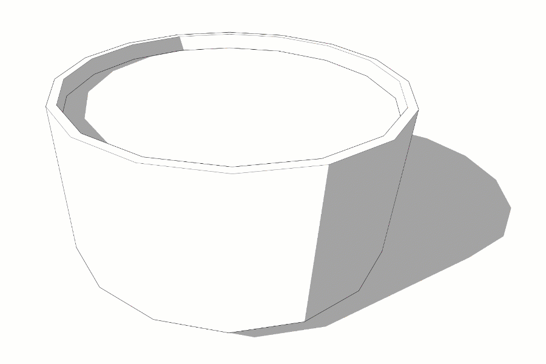
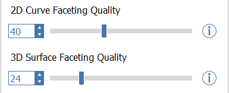
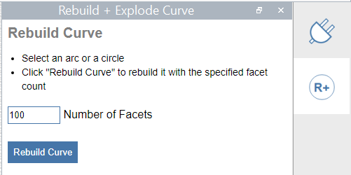
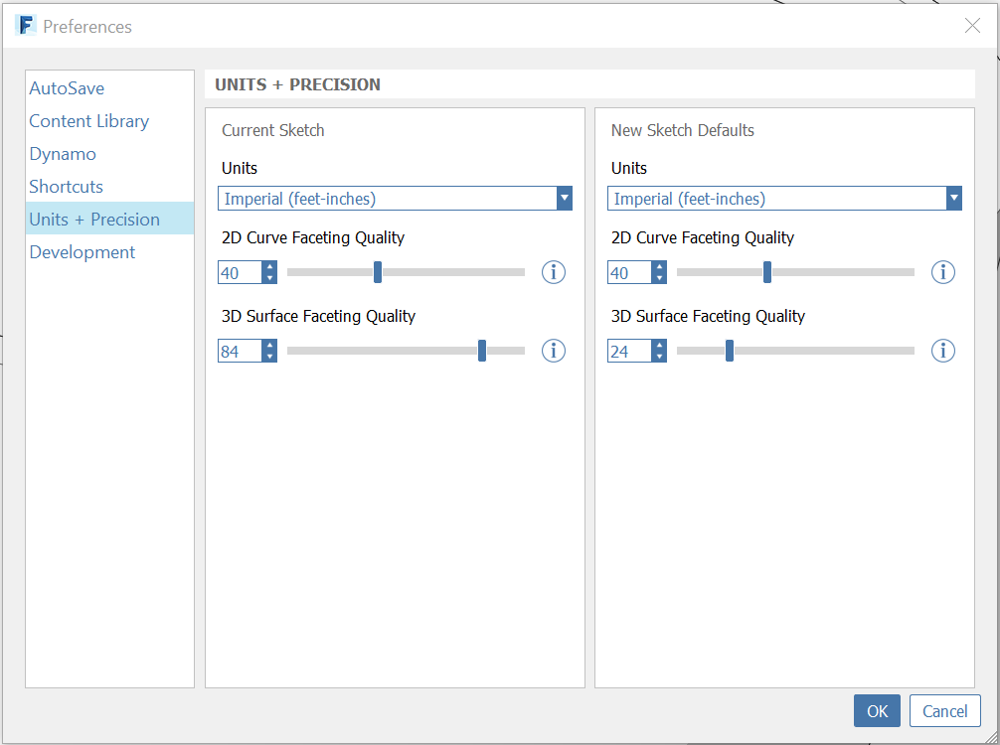
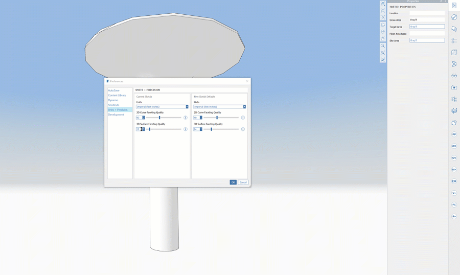

# Curve + Surface Faceting

FormIt is a polyhedral modeling system, so objects like circles, arcs, and splines are represented by a series of straight edges. Similarly, a curved surface like the wall of a cylinder, or a dome, is comprised of a series of planar faces with hidden border edges.

By default, FormIt uses 40 edges, or facets, to represent a circle, and 24 facets to represent a 3D, curved object like a cylinder. For more complex surfaces like a dome, a value of 24 sets the perimeter faceting count, and also impacts how densely faceted the rest of the shape is.

In FormIt for Windows v18 and newer, the curve and surface faceting values are customizable:

**Curve Faceting Quality**

Changing this global setting will affect how many facets are used when drawing new circles and arcs in FormIt, as well as when placing primitive shapes. For example, setting this to 64 would create a 64-sided full circle, or a quarter-circle arc with 16 facets.

This value will also affect the quality of circles and arcs imported from SAT files, as well as when baking geometry to Dynamo. You can set this value for all new models, or just the current model.

For existing curves, you can still use the Rebuild Curve plugin to retroactively rebuild an existing arc or circle with a new faceting count:

**Surface Faceting Quality**

Changing this global setting will affect the quality of 3D curved surfaces imported from SAT files and when baked from Dynamo. 

For example, setting this to 64 then baking a sphere from Dynamo will use 64 faces around the equator of the sphere, plus 64 facets in each of the rings going to the poles of the sphere, which adds up quickly! Use higher values with caution, as it can affect the performance of FormIt in some cases. Once you've got a result that's high quality, you can [convert it into a Mesh](meshes.md) to improve performance.

As with curves, you can set the faceting quality for all new models, or for the current model only. 

Note that faceting values are currently locked to multiples of 4, so entering values manually will round to the nearest multiple. You can use the sliders and arrows to cycle through accepted values.

When working with Dynamo, you can modify the faceting quality, and hit "Run Graph" in the Properties Panel without changing any parameters, to take advantage of new faceting counts:

