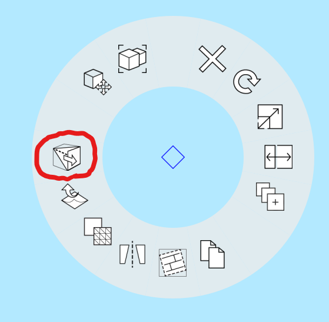

# Faces: Flatten

Use Flatten Faces to force a series of faces into the same plane. 

Flatten Faces can be accessed via the right-click context menu, or via shortcut FL.

Flatten Faces can be useful as a repair tool, when a face that should be planar becomes unexpectedly faceted \(with smooth edges between the facets\) - either when importing lower-fidelity data like [SketchUp models](https://formit.autodesk.com/blog/post/using-formit-to-get-sketchup-data-into-revit#flatten), or after accidentally moving a vertex or edge which causes a face to get faceted/triangulated.

Flatten can also be used as a design tool, to "align" or "extend" shapes by selecting a guide surface first, then selecting subsequent faces to flatten to the plane of the first surface.

Check out the video below to see the power and versatility of Flatten Faces:



