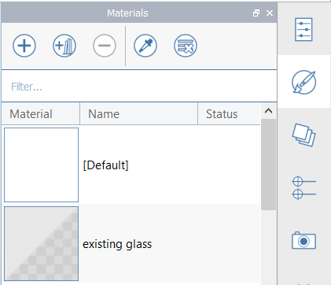
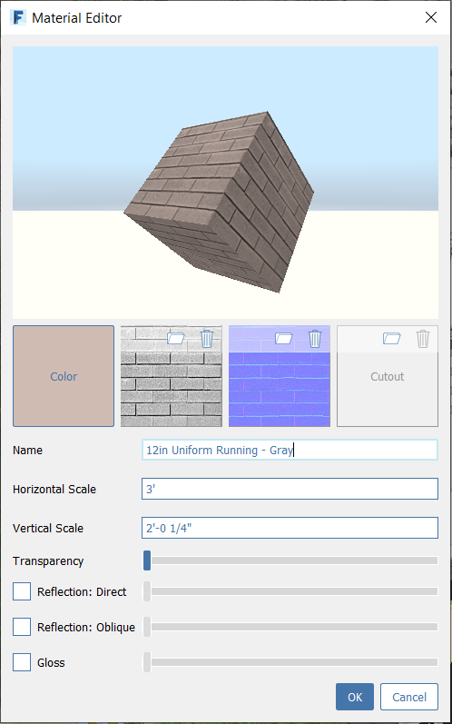
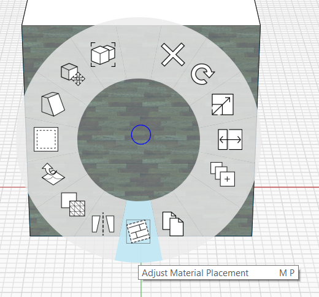

# Materials

Make your FormIt models pop with Materials that support reflection, gloss, and bump maps.

## The Materials Panel

### Create, Import, and Delete

 **Create a new Material** by defining its color, texture, bump map, cutout map, transparency, and reflection/gloss.

 **Import a Material** from the Autodesk Materials Library.

 **Delete** selected Material\(s\)

### Eyedropper

 

Use the Eyedropper to sample a Material painted in the scene, and immediately start painting with it. 

* Click the Eyedropper tool, then click a face painted with a Material
* The Material that's found on the face will be highlighted in the panel, and the Paintbrush tool will become active with that Material loaded.

### Purge Unused

 

Unused Materials can accumulate naturally through the process of iteration, but they can add significantly to the file size if they use high-quality textures.

Click the Purge Unused tool to delete all unused Materials. You'll see a prompt first, so you can cancel if you have second thoughts.

### List Management

Adjust the size of the thumbnails by adjusting the width of the column \(click and drag the vertical line to the right of "Material"\).

Filter for specific Materials by typing in the "Filter..." bar.

### Material Interactions

**Paint a Material** by single-clicking clicking the thumbnail. You'll be placed into the Paintbrush tool, where you can now hover over geometry in the FormIt canvas and click faces or Groups to paint them.

Once you're in the Paintbrush tool:

* Paint faces and Groups by single clicking.
  * When painting Groups, the Material will cascade into the nested geometry and will cover any surface or Group painted with the Default Material.
* Paint entire solids by double-clicking a face to select everything attached.

You can also select faces and Groups first, then single-click a Material thumbnail to paint the selection with that Material.

**Edit a Material** by double-clicking on the thumbnail, which will bring up the Material Editor \(see below\).

**Rename a Material** by double-clicking the name.

**Identify a Material** painted on geometry by selecting it, and looking for the highlight and icon indicating what Material\(s\) are painted on the selected geometry.

**The Default Material** can be used to effectively "clear" a face or a Group of any Materials. Any geometry not painted with a Material is implicitly painted with the Default Material.

## Create and Edit Materials

  
When you create or edit a Material, you'll see the Material Editor dialog, where you can customize:

* **Color**
* **Texture from an image file**
  * JPG or PNG
* **Bump map from an image file**
  * JPG recommended
  * Great for adding depth effects to Materials.
  * You can use freeware like Shaderforge to generate bump maps given a texture.
* **Cutout map from an image file**
  * PNG
  * Great for Materials that have selective transparency, like chainlink fences or perforated panels. 
* **Name**
* **Horizontal and Vertical Scale**
  * Stretch a Material by adjusting horizontal scale independently from vertical scale.
  * You can override the horizontal and vertical scale per-face using the Adjust Material Placement tool \(see below\).
* **Transparency**, **Reflection**, and **Gloss**

## Adjusting Material Placement

When painting a Material on a face, FormIt takes a best guess as to the best orientation:

* Vertical faces will orient with the texture's top oriented along the Z axis.
* Horizontal faces will orient the texture lengthwise along the longest side of the face.

Use the **Adjust Material Placement** tool to override the default Material placement, as well as the Material's scale on specific faces:

* Select a face or faces painted with a Material
  * If the face is inheriting its Material from its parent Group, you'll need to paint the face directly first.
* Access the Adjust Material Placement dialog through the shortcut MP or from the right-click context menu:

On screen graphic controls are now displayed, which can be used to interactively move, rotate and scale the material textures directly on the face.

To reset any of the changes to the material placement, simply paint the face again with the original material.

## Material Translation to Revit

Materials will transfer to Revit when using the [FormIt Add-In](https://formit.autodesk.com/page/formit-revit) for Revit 2018 or later.

