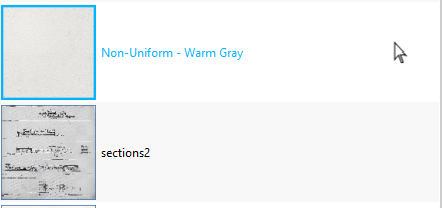

# Materials

Make your FormIt models pop with Materials that support reflection, gloss, and bump maps.

## The Materials Panel

### Create, Import, and Delete

 **Create a new Material** by defining its color, texture, bump map, cutout map, transparency, and reflection/gloss.

 **Import a Material** from the Autodesk Materials Library.

 **Delete** selected Material\(s\)

### Eyedropper

Use the Eyedropper to sample an existing Material painted in the scene, and immediately start painting with it. 

* Click the Eyedropper tool, then click a face painted with a material
* The Material you sampled will be highlighted in the panel, and the Paintbrush tool will become active with that Material loaded.

When you single click on a material preview tile in the Materials palette you are placed into the paint brush tool. Now you can apply materials to geometry in the model

1. Paint faces of geometry by single clicking on them
2. Paint solids by double clicking on them to paint all faces at once
3. If you have groups in your model - you need to edit the group that has geometry you want to paint
4. You can paint groups in FormIt. When you single click on a group, this will apply a material to each face of the group that doesn't already have a material. Consider this a material override
5. In order to 'remove' paint from any of the above elements - you can choose to paint with the 'default' material

When you select an object in the scene, the material\(s\) applied to that object are highlighted in the palette

### Eye Dropper

You can use the Eye Dropper tool to select an existing material in the scene. The material is immediately selected and ready to be painted onto other surfaces in the model.

## Create and Edit Materials

Hit the "+" icon to create a new material. You can double click the material name in the palette to rename it

When you create a material you are put into the Material Editor dialog where you can specify material properties. Once a material is created and the editor is close, you can edit the material again by double clicking the preview tile in the palette.

1. Specify a color \(or tint\) that shades the material surface
2. Choose an image file texture to give a realistic appearance to surfaces
3. Bump maps \(derived from a texture\) can be added to the material to give 3d relief to a surface
4. Cut out maps can be added to give a transparent pattern to surfaces like a chain link fence or perforated panel

The Vertical and Horizontal scale parameters give you an opportunity to scale up the texture size

Beyond the maps you can adjust these advanced parameters to give your materials a more dynamic appearance in the canvas

1. Transparency is a slider which simulates glass
2. Reflection will reflect a default image that FormIt uses for a background image
3. Gloss increases the impact of a light shining on your materials that already have reflection applied

## Purge Unused Materials

Materials can significantly increase the size of your file. If you have materials that are not being used in the scene, you can use the Purge tool - located in the palette toolbar.

## Import Materials

FormIt gives you access to the Autodesk Material Library so that you can import pre made materials to your models.

## Material translation to Revit

When you take the time to create and apply a material texture in FormIt - your geometry will maintain this material when importing to Revit. This gives you an incredibly fast transition between conceptual and detailed design phases of projects. You can also render, create presentation elevation views, and utilize other visualization Add-Ins in Revit.

