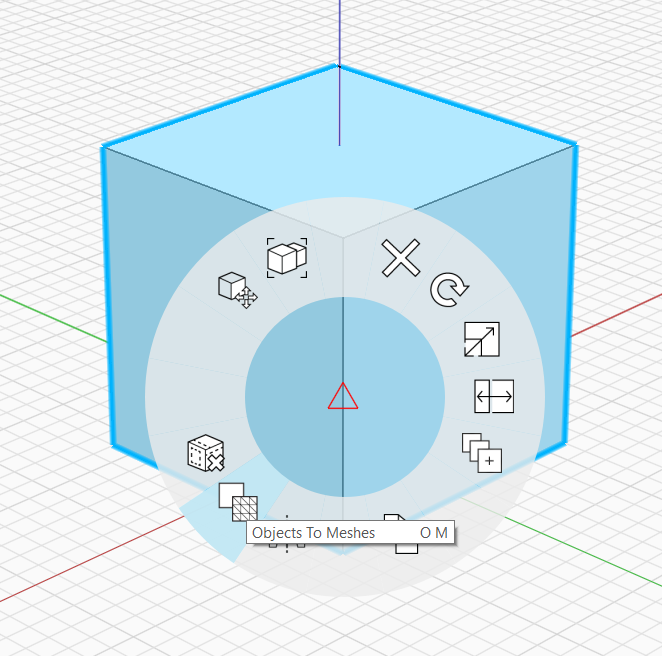

# Meshes

Starting in v17.0, FormIt offers a new type of geometry: a Mesh. 

Meshes are lightweight representations of standard FormIt Objects, and are great for improving the performance of high-polygon geometry like furniture or 3D entourage like people, trees, cars, and signage. Meshes are also great for complex DWG geometry that might otherwise affect FormIt's performance. 

Objects can be converted to Meshes, and Meshes can be converted back to Objects without losing any data. Learn more about converting between types, and other benefits and limitations of Meshes below.

### Converting Objects to Meshes

Any combination of edges, faces, or solid bodies can be converted to Meshes. 

Simply select Objects, and either use shortcut OM \(Objects to Meshes\) or right-click and select Objects to Meshes in the Context Menu:

Once the objects have been converted to Meshes, you'll see a confirmation message at the top of the screen:

When converting Objects to Meshes:

* Edges that were smoothed on the Objects will remain smoothed in the resulting Meshes.
* Material orientations on the Objects will remain unchanged in the resulting Meshes.

Converting Grouped geometry to Meshes:

* Meshes become even more powerful when you can convert an entire Group and all of its nested Groups into Meshes
* Groups and their nested contents can be converted to Groups by using a plugin:

