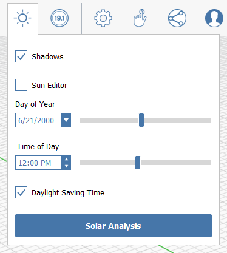

# Sun + Shadows

Study the effects of the sun's path on your projects.

The first step for accurate shadow studies is to [**set your project location**](setting-location.md). 

Once you've set your location and optionally imported a satellite image, model your project including building context, and shading elements like louvers and trees.

Turn shadows on in the Sun + Shadows flyout at the top of the application \(this can also be done in [**Visual Styles**](../formit-introduction/tool-bars.md)\).

From here, you can adjust the time of day and day of year. The default year is shown as 2000 - don't worry, this doesn't affect the accuracy of the sun shading study.

You can also toggle the Sun Editor, which provides a graphical display of the sun's location in space:

The Sun Editor will move with the camera, so you may have to adjust your zoom level and/or camera orientation to get the widget in a position that makes sense relative to the design you're studying.

