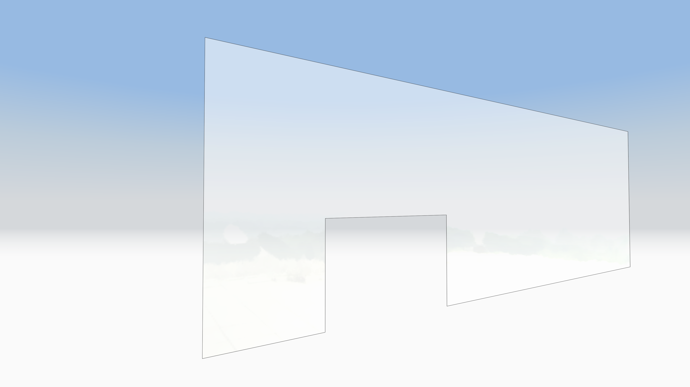
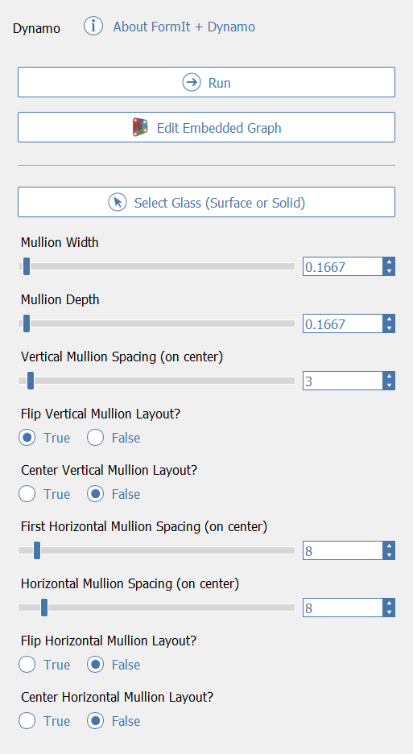

# Storefront/Curtainwall Mullion System

## Powered by Dynamo

The ability to quickly create storefront/curtainwall mullion systems in FormIt is powered by Dynamo. You can find the Storefront Curtainwall system in the Dynamo Samples directory in the Dynamo panel:

## Selecting "Glass" For Mullion System

Starting in FormIt 2021.2, the Storefront Curtainwall system uses the new [SelectFromFormIt node](https://formit.autodesk.com/page/formit-dynamo#dynamo-formit-nodes), allowing you to select a piece of "glass" \(a single face or an extruded solid\) around which to generate a mullion system.

When you click the Storefront Curtainwall thumbnail \(notice the icon indicating that a selection is required\), FormIt will prompt you to select the glass geometry to continue:

A few notes and caveats about how selecting glass works:

* Currently, only planar surfaces are supported. If you select a series of surfaces \(for example, a "curved" surface comprised of smaller planar surfaces\), the script will find the largest planar face and will use that.
* If your glass is solid - i.e. a single face extruded very slightly to convey a bit of thickness - the script will find the biggest surface, so the resulting mullions will generate on one side of the glass solid.
* You can sketch openings for doors, and remove the resulting surface from the glass boundary, and the resulting mullions will respect the door opening, leaving it blank for the addition of doors.
* Due to Dynamo limitations, this script won't work if the glass geometry has openings in the middle.

## Tips and Tricks

When selecting geometry for a Dynamo graph in FormIt, certain organizational tricks can simplify the experience and allow for easy instancing of results:

* Put the glass in a Group, and use the Group as the selection for the Storefront/Curtainwall script. That way, it's easier to edit the glass profile after the mullions have been generated, and if the glass is heavily modified between runs and the face IDs have changed, the Group ensures that the script will always find the glass - because it's using the Group ID, not the face ID.
* If you're planning on copying and pasting the results of the mullion system to other places in your model, it's best to have the glass and the resulting mullions contained in a Group This will also prevent issues with the selection node not knowing which glass instance to use when just the resulting mullion Group is copied and pasted.
  * Put your glass in a Group first. Double-click it to select the glass, and hit G or use the Group commands in the context menu or toolbar. 
  * Select the resulting Group, and put it in another Group.
  * Double-click to enter the first Group. This is the "container" for both the glass and the resulting mullions.
  * Click the Storefront Curtainwall thumbnail, and use the glass Group as the selection. 
  * After the script runs, you can exit the Group and copy/paste the container around as needed. You can edit any of the instances \(adjusting the glass shape or parameters\) without issue.

## Mullion System Options

Once you select glass and run the script, you'll get a result in the FormIt canvas, in the form of a FormIt Group. This Group will be automatically selected, and the Properties panel will reveal the available options.

The script will use default values for its first run, so you'll want to adjust these for your unique use case. All values will use the current FormIt units.

* **Select Glass \(Surface or Solid\)**: Click this to update the selection to a different piece of glass around which to generate mullions.
* **Mullion Width + Depth**: The width and depth of all mullion elements.
* **Vertical Mullion Spacing**: The distance, on center, between each vertical mullion.
* **Flip Vertical Mullion Layout**: The script starts the vertical mullion spacing from one side, chosen arbitrarily. If the result starts the mullion spacing on the wrong side for your use case, set this to True to flip the layout to start on the opposite site.
* **Center Vertical mullion Layout**: Instead of starting the vertical mullion spacing calculation at one end of the glass, start the calculation in the middle, creating a symmetrical layout of vertical mullions.
* **First Horizontal Mullion Spacing**: Sets the first horizontal mullion spacing from the bottom. Useful if you need a row of shorter glazing modules at the bottom, separate from the rest of the horizontal mullion spacing.
* **Horizontal Mullion Spacing**: The typical horizontal mullion spacing, on center, starting after the first mullion as outlined above. 
* **Flip Horizontal Mullion Layout**: If you want the horizontal mullion layout to start at the top instead of the bottom, set this to True.
* **Center Horizontal Mullion Layout**: Instead of starting the horizontal mullion spacing calculation at the bottom or top of the glass, start the calculation in the middle, creating a symmetrical layout of horizontal mullions.

## Hidden Options

Looking for more customization? Several advanced options are hidden from the FormIt properties panel, but are accessible by clicking "Edit Embedded Graph" to reveal the full graph contents in Dynamo:

### Randomized Mullions

* **Randomize Vertical and Horizontal Mullion Layout**: Set this to True to space the vertical or horizontal mullions randomly
* **Min/Max Mullion Spacing \(if random\)**: Adjust these values to set a range of minimum and maximum randomized spacing values

### Border Mullions

* **Flip Offset Direction of Border Mullions:** By default, the mullion system will use the glass boundary, and offset it inward to create the border mullions. To offset outward, set this option to True. This will increase the overall size of the mullion system outside the glass boundary by the Mullion Width setting.
* **Tolerance Between Selection and Border Mullions**: By default, the mullion system will generate exactly at the border of the glass, which could cause Z-fighting where the edge of the glass and the outer surfaces of the border mullions collide. In most cases, this won't be visible, but if your use case requires the edges of the system to be visible and you want to avoid Z-fighting, enable this option and adjust the tolerance value as necessary.

