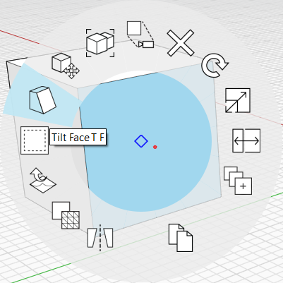
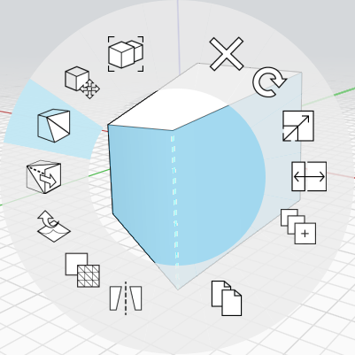
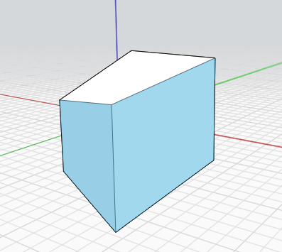

# Faces: Tilt and Facet/Smooth

## Working with Faces: Tilt and Facet/Smooth

To create more complex designs after sketching a shape or placing a primitive, you can use several contextual tools to modify your geometry. These operations include Tilt, Array, and Copy and Paste.

### Tilt Face

To **tilt a face:**

1. Select a face and right-click to see the context menu. 
2. Choose the **Tilt** icon from the context menu.
3. Define the tilt axis by drawing a line. 
4. Click a third point to start the tilt operation.

  
  

### Facet / Smooth Faces

If you hover over a face and notice dotted lines, this means the face is made up of smaller faces due to the face being warped. To **turn the dotted lines into model edges:** 

1. Select the face or object that you want to change and right-click to see the context menu. 
2. From the context menu, choose the **Facet Smooth Faces** tool. 
3. Edges are automatically added where the face was previously smooth. 

This command works in the opposite way, also: you can select faces that are faceted and select the **Facet Smooth Faces** tool from the context menu to hide the edges and make the faces appear smooth.

  

## 

